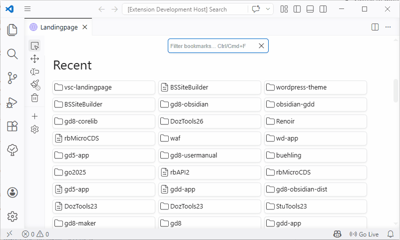

# Change Log

All notable changes to the "vsc-landingpage" extension will be documented in this file.

<!-- Check [Keep a Changelog](http://keepachangelog.com/) for recommendations on how to structure this file. -->

## [0.0.4] - 2026-06

### Fixed

- Long label texts are now clipped also for card layouts, no more overlapping.

## [0.0.3] - 2026-04-04

### Added

- *Show Landingpage* appears in command palette now.
- Filter input field allows to highlight elements with keyword search.

## [0.0.2] - 2025-02-10

### Fixed

- Quick basic fix for toolbar icon colors which now use `--vscode-activityBar-foreground` to work with color themes.

## [0.0.1] - 2025-02-10

- Initial release

### Added 

- Render webview with scss and js contents.
- Create and delete groups 
- Import files or folders as bookmarks
- Open linked path on click
- Rename groups or bookmarks
- Drag and drop organisation of bookmarks within same or across groups
- Drag and drop sorting of groups
- Store and restore bookmarks in extension's globalStore
- Using [Lucide](https://lucide.dev/icons/folder-plus) icons
- Color picker for cards
- Card and List layouts for groups
- Display of recent elements from VS Code 
- Delete/Reset Landingpage

<!--
Future plans:

- Custom icon or image, esp. on cards
- Filter and/or sorting
- Export/Import landingpage model
- Renameable Recent Group
- Custom colors
- Collapse/Expand

-->