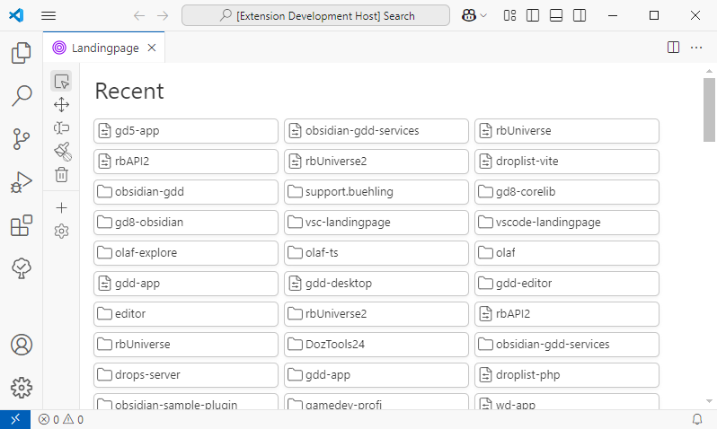
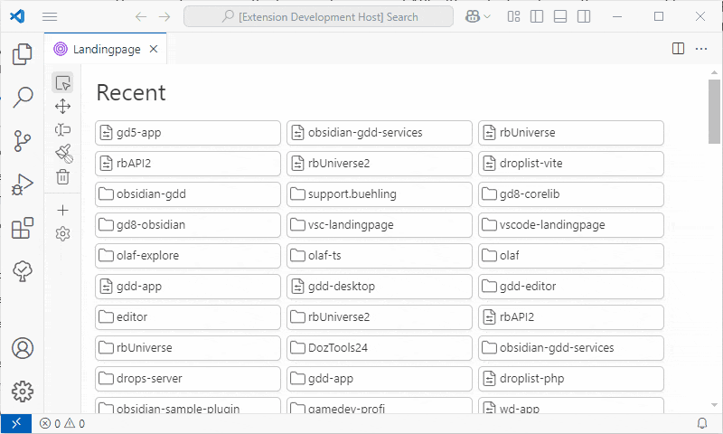
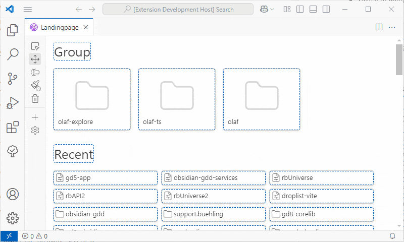
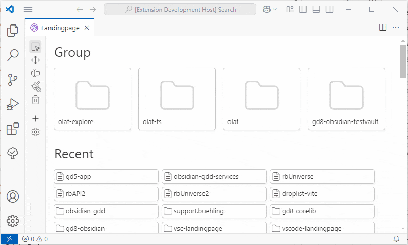
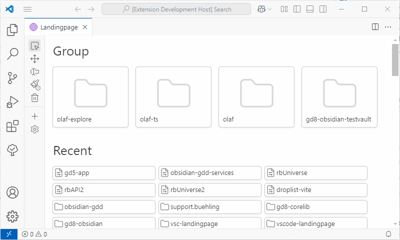
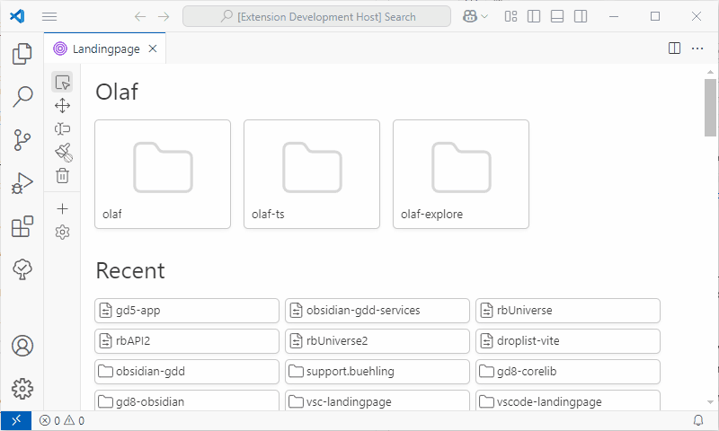

# Landingpage

Use this extension to create and organise bookmarks to folders, files and workspaces in a personal startup page. VS Code's default *recently used* list is a strict temporal list without reflecting your personal working status. But you might want to keep shortcuts to your currently active projects still in sight even when you work on other things for a while.

Landingpage extension shows both, VS code's recently used files and folders as well as custom bookmarks which can be organised in groups, renamed, ordered and colorized. 

## Features

### Startup: Default List

Landingpage is automatically opened when a VS Code window is opened without folders or workspace context. This can be enabled/disabled in extension's settings.

By default a list appears which mirrors most recently used files in Visual Studio Code. This is identical to menu items in *File > Open Recent* menu.

One item that points to a file, folder or workspace is called **bookmark** in this documentation. 

Click on a bookmark to open the linked file, folder or workspace in the current window. If a target is already already open in another VS Code window, that window may be focussed instead.

### Use custom groups to pin projects

To organize your bookmarks in a specific order or thematic collections use **groups**:

- Create a new group by clicking the plus button in toolbar. 
- Switch to move tool in toolbar.
- Drag and drop the bookmarks into your group.

#### Direct import from File System

You can also add items which are not yet in the MRU list using **file or folder picker**:

- Switch to Reader Tool.
- Point to a group header.
- Click on the file or folder button to add a bookmark to a file, workspace file or directory.

> **Group *Recent* is read-only.** Its content is populated from Visual Studio's recently used items. You cannot add any entries here. See also: [Understanding 'Recent'](#recent)

### Rearrange bookmarks per Drag and Drop

Use drag and drop in move mode to customize the order to your needs: 

- Switch to Move Tool.
- Drag bookmarks and drop on other bookmarks to move them forwards or backwards.
- Drop bookmarks to group labels to add them to the end of that group. This can also be used to move bookmarks into yet empty groups.

> **Group *Recent* is read-only.** You can drag bookmarks *from* Recent *to* other groups, but not the other way around. The order of bookmarks within Recent group cannot be changed. See also: [Understanding 'Recent'](#recent)

### Customize Appearance

#### Rename Bookmarks and Groups

Labels of bookmarks and groups are initialized with the name of the linked file or folder, but they are freely customizable display texts. To rename the display text of bookmarks or groups in Landingpage:

- Select Rename tool in toolbar.
- Click on a bookmark or group name.
- Enter a new name in popup.

> **Group *Recent* is read-only.** Labels of bookmarks or the Recent group itself are detected automatically and cannot be changed. See also: [Understanding 'Recent'](#recent)

#### Colorizing Bookmarks and Groups

Use paint tool to change the color shade of bookmarks:

- Select Paint tool in toolbar.
- Pick a color from palette popup. Click outside the popup to close it to keep currently selected color.
- Click on bookmarks to change their color.

**To remove coloring:**

- From palette popup select lined slot which represents transparency.
- Click on the bookmarks to remove their coloring.

> **Group *Recent* is read-only.** Color of bookmarks in Recent list cannot be changed. See also: [Understanding 'Recent'](#recent)

#### Switch List or Grid Layout

Bookmarks can be rendered as big cards or as small list. Cards are visually dominant and may be used for your important favorites. Lists are useful to show a group of many bookmarks in efficient way. To change the layout of a group, use the groups layout button: 

- Hover over a group name.
- Click Layout button to change the layout of bookmarks in this group.

> **Group *Recent* can be changed, too!** It **is** possible to change layout of Recent group, because this is just a view setting independent from the VS Code data source. See also: [Understanding 'Recent'](#recent)

### Remove items per Delete Tool

Groups and bookmarks can be removed from Landingpage. The original linked target stays untouched. Note that deletion is not revertable.

- Select Remove tool from toolbar. 
- Click on bookmarks or groups that you want to delete.
- Confirm popup to remove the element from Landingpage.

> **Tip:** Hold `Ctrl` while clicking to skip confirmation dialog and delete the element immediately.

> **Group *Recent* is read-only.** Neither bookmarks nor the group itself can be removed. See also: [Understanding 'Recent'](#recent)

### Understanding *Recent* Group

"Recent" group is a collection of bookmarks that behaves similiar to user created groups, but it is populated automatically. Therefore all changes would be lost on update which is why most editing is locked here. 

"Recent" bookmarks are refreshed whenever Welcome page is reopened or when Reset-Command is called from Landingpage View's "..." menu.

### Support for Dark Theme

Landingpage works with light and dark theme:

## Extension Settings

This extension contributes the following settings:

* `vsc-landingpage.autoshowOnStartup`: Enable/disable automatic opening of Landingpage in empty windows.

<!-- ## Known Issues

Calling out known issues can help limit users opening duplicate issues against your extension.

## Release Notes

Users appreciate release notes as you update your extension.

### 1.0.0

Initial release of ...

### 1.0.1

Fixed issue #.

### 1.1.0

Added features X, Y, and Z. -->

<!-- 

Build notes see DEVELOP.md

-->